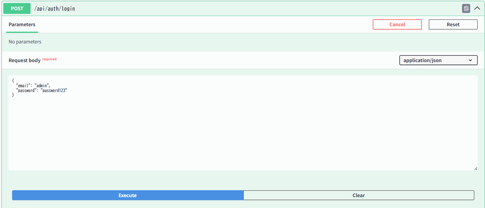
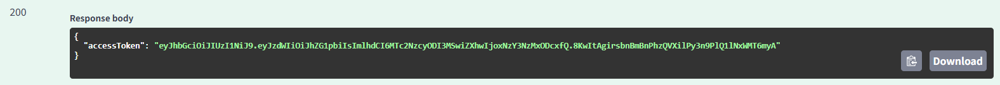
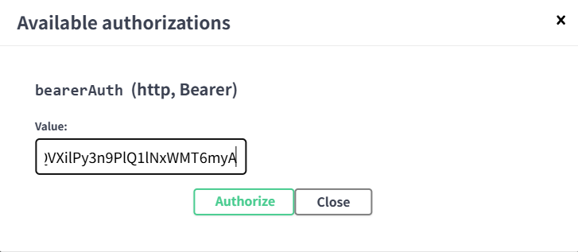

# Buddy House 

## 制作背景
サービスの概要は、実家で営むペットホテルの業務を効率化するために開発した
ペットホテル向けWeb予約管理アプリケーションです。

予約管理を紙やカレンダーで行っており、  
「予約状況の把握がしづらい」「過去の予約履歴をすぐに確認できない」といった課題がありました。

顧客・ペット・予約・予約枠・メニューを一元管理し、  
管理者と会員（顧客）それぞれの立場で操作できる構成になっています。

---

## アプリURL
https://buddy-house-app.com/swagger-ui/index.html#/

### 動作確認用テストアカウント
アプリの全機能をすぐに確認いただけるよう、テスト用のアカウントを用意しています。

| ロール | メールアドレス | パスワード |
| :--- | :--- | :--- |
| **管理者(ADMIN)** | `admin` | `password123` |
| **会員(CUSTOMER)** | `user@example.com` | `password123` |

## 🚀 クイックスタート (Quick Start)

Swagger UI 上でログインを行い、JWT 認証を有効化することで、ロール毎の API を実行できます。

1. **Login**: `POST /auth/login` を実行し、検証用アカウントでログインします。
2. **Copy**: レスポンスに含まれる `accessToken` をコピーします。
3. **Authorize**: 画面右上の `Authorize` ボタンにトークンを設定します。

📸 スクリーンショット付きの詳細手順を見る（クリックで展開）

### 1. ログイン
Authの **Login**: `POST /auth/login` を開き、アカウント情報を入力して `Execute` をクリックします。

### 2. トークンのコピー
レスポンスボディに含まれる `accessToken`（文字列）をコピーします。

### 3. 認証の有効化
画面右上の **Authorize** ボタンを押し、コピーしたトークンを入力して `Authorize` をクリックします。

---

## ER図

---
## インフラ構成図

---

## 使用技術

### バックエンド
- Java 21
- Spring Boot
- Spring Security（JWT認証）
- JPA / Hibernate
- MySQL
- Gradle

### インフラ・その他
- AWS（EC2 / RDS）
- Swagger（APIドキュメント）
- GitHub（バージョン管理）

---

## 機能一覧

### 認証・認可
| 機能 | 説明 |
|---|---|
| 会員登録 | 顧客アカウントを新規作成 |
| ログイン | JWT認証でアクセストークンを発行 |
| ロール管理 | ADMIN / CUSTOMER のアクセス制御 |

### 会員（CUSTOMER）
| 機能 | 説明 |
|---|---|
| 自分の顧客情報取得 | `/customers/me`（ログイン中ユーザーの情報取得） |
| ペット管理 | ペット情報の登録・削除（会員自身のペットのみ） |
| 自分の予約一覧取得 | `/reservations/me`（ログイン中ユーザーの予約一覧） |
| 予約作成 | 予約枠に対して予約を作成 |

### 管理者（ADMIN）
| 機能 | 説明 |
|---|---|
| メニュー管理 | 作成・販売停止・削除（管理者のみ） |
| 予約枠管理 | 作成・満室制御・削除（管理者のみ） |
| 顧客情報の検索・閲覧 | 条件検索および詳細閲覧 |
| 顧客管理 | 登録・編集・検索・閲覧・論理削除 |

## 設計上のポイント

- JWT + ロールベース認可により、管理者と会員の責務を明確に分離
- `/me` 系 API を用意し、ログインユーザー自身のデータ操作を安全に実現
- 論理削除を採用し、業務データの履歴を保持

---

## 何ができるか
